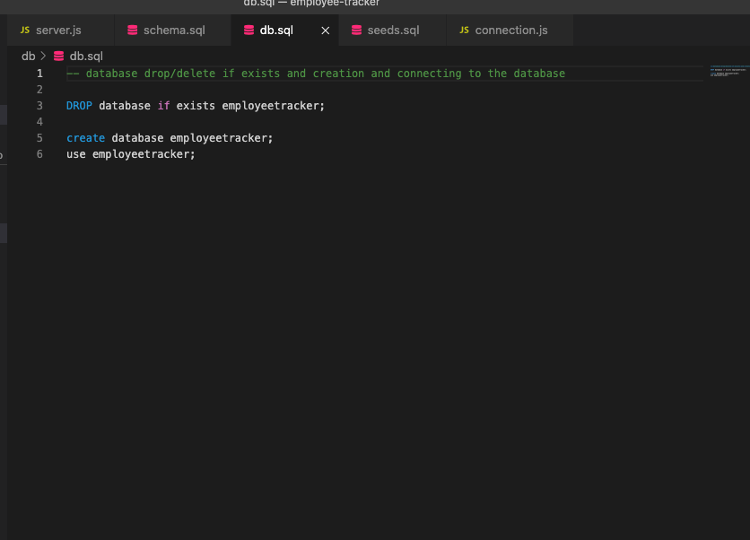

# Employee Tracker

### Description:
```
Developers frequently have to create interfaces that allow non-developers to easily view and interact with information stored in databases. These interfaces are called content management systems (CMS). Your assignment this week is to build a command-line application from scratch to manage a company's employee database, using Node.js, Inquirer, and MySQL.

Because this application won’t be deployed, you’ll also need to create a walkthrough video that demonstrates its functionality and all of the following acceptance criteria being met. You’ll need to submit a link to the video and add it to the README of your project.
```

## Acceptance Criteria
```
GIVEN a command-line application that accepts user input
WHEN I start the application
THEN I am presented with the following options: view all departments, view all roles, view all employees, add a department, add a role, add an employee, and update an employee role
WHEN I choose to view all departments
THEN I am presented with a formatted table showing department names and department ids
WHEN I choose to view all roles
THEN I am presented with the job title, role id, the department that role belongs to, and the salary for that role
WHEN I choose to view all employees
THEN I am presented with a formatted table showing employee data, including employee ids, first names, last names, job titles, departments, salaries, and managers that the employees report to
WHEN I choose to add a department
THEN I am prompted to enter the name of the department and that department is added to the database
WHEN I choose to add a role
THEN I am prompted to enter the name, salary, and department for the role and that role is added to the database
WHEN I choose to add an employee
THEN I am prompted to enter the employee’s first name, last name, role, and manager, and that employee is added to the database
WHEN I choose to update an employee role
THEN I am prompted to select an employee to update and their new role and this information is updated in the database
```

## User Story
```
AS A business owner
I WANT to be able to view and manage the departments, roles, and employees in my company
SO THAT I can organize and plan my business
```


## Table of contents
1. [Title](#title)
2. [Description](#description)
3. [Installation](#installation)
4. [Usage](#usage)
5. [Contributing](#contributing)
6. [Test](#test)
7. [License](#license)
8. [Questions](#questions)

## Title
Employee Tracker

## Description
Employee Tracker Database

## Installation
clone the repository locally and run `npm install inquirer` `npm install mysql2` `npm install express`

## Usage
run either `npm start` or `node server.js`

## Contributing
Always create a PR with own branch and push for review/approval

## Test
Test on local environment

## License
[MIT](https://gist.github.com/nicolasdao/a7adda51f2f185e8d2700e1573d8a633#mit-license)

## Questions
Nothing at this time<br />
Find me on Github [kazichaska](https://github.com/kazichaska)<br />
Email me with any question: kazichaska@gmail.com <br />


## Deployed Application Video Link 
Below is the recorded video link of deployed application and how to use it:
https://youtu.be/Ig0e0lAPpd4

## Screenshots of the code





